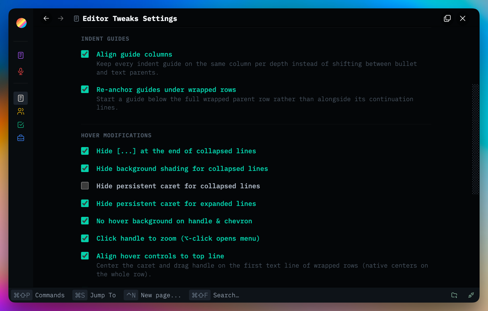

# Editor Tweaks

Uniform editor line geometry and Thymer's native hover controls, tuned in place — nothing is redrawn, no controls are replaced.

Open **Plugin: Editor Tweaks** from the command palette.

Absorbs the older **Hover Tweaks** plugin (archived under `plugins/_archive/`); its behavior toggles and cursor system live here now.

Plugins are made with 🤍 for the Thymer community. Free to use, fork, and hack on for <a href="LICENSE" target="_blank" rel="noopener noreferrer">non-commercial use</a>.

Plug-ins take effort, hours, and credits to build. If you find them helpful for you and your workflows, a star ⭐ on the repo, a <a href="https://buymeacoffee.com/akaready" target="_blank" rel="noopener noreferrer">coffee</a> ☕, and a link back to <a href="https://akaready.com" target="_blank" rel="noopener noreferrer">@akaready</a> 🔗 all go a long way. Optional of course, but always appreciated.

Enjoy! 🙏

  

&nbsp;

## 📦 Install

**Recommended:** Use the [Thymer Plugins Manager](https://github.com/ahpatel/thymer-plugins-manager) and install via [this repo's URL](https://github.com/akaready/thymer-editor-tweaks) for automatic updates.

**Manual:** copy <a href="plugin.js" target="_blank" rel="noopener noreferrer"><code>plugin.js</code></a> and <a href="plugin.json" target="_blank" rel="noopener noreferrer"><code>plugin.json</code></a> from this repo into Thymer's plugin editor.

&nbsp;

## 🔁 Settings Sync ("This device" vs "All devices")

The settings panel header shows a scope pill. By default a device follows the shared, synced settings (`○ All devices`). The moment you change something, the change applies to **this device only** — the pill lights up (`● This device`) and two buttons appear: **↑ apply these settings to all devices** (one tap) and **↺ discard device changes** (tap twice) to go back to the synced settings. If your edits bring the device back to an exact match with the synced settings, the pill clears itself. Devices that haven't been touched follow pushes from other devices live.

## ✨ What It Does

### Indent Mode

Regular text lines indent to the bulleted text column, so bullets hang left and text always starts at the same column. Off = native text alignment.

### Indent Guides

- **Align guide columns** — Thymer draws indent guides at slightly different horizontal positions depending on whether the parent line is a bullet or plain text (a ~6px kink between segments). This keeps every guide on the same column per depth.
- **Re-anchor guides under wrapped rows** — natively a guide starts one line below the parent's top, so under a wrapped parent it runs alongside the parent's own continuation lines. This starts it below the full row instead.
- The expanded ▼ fold caret wears the indent guide's own color token instead of the bright native glyph, so it reads as the head of the line.

### Hover Modifications

- Hide the `[...]` unfold indicator at the end of collapsed lines
- Hide background shading for collapsed lines
- Hide the persistent caret for collapsed and/or expanded lines
- No hover background on the handle & caret
- **Click handle to zoom** — plain click zooms into the record, `option`-click opens the options menu (Thymer ships the reverse). Press-and-hold still grabs for drag.
- **Align hover controls to top line** — center the caret and drag handle on the first text line of wrapped rows (native centers on the whole row). Off by default.
- **Align drag handle to caret** — scoot the drag handle so it lines up with the fold caret, with live-editable top/left offsets.

### Hover Cursors

Pick any macOS cursor for the handle's zoom and menu affordances (defaults: resize-east for zoom, resize-down for menu). Searchable picker with live previews.

&nbsp;

## 📊 Anonymous Usage Counter

This plugin pings a <a href="https://www.goatcounter.com/" target="_blank" rel="noopener noreferrer">privacy-respecting counter</a> on first install and once per day of active use. It exists so I can see which plugins are worth continuing to invest in — both "did anyone install it" and "is anyone still using it after a week." Combined with the coffee donations, this is what tells me whether to keep building. It tracks the plugin slug only, no other telemetry or user data, and you can see exactly what I see on the <a href="https://thymer-plugins.goatcounter.com" target="_blank" rel="noopener noreferrer">public dashboard</a>.

**Opt out:** Do Not Track, or `localStorage.setItem('tps-telemetry-opt-out','1')` in the console.
